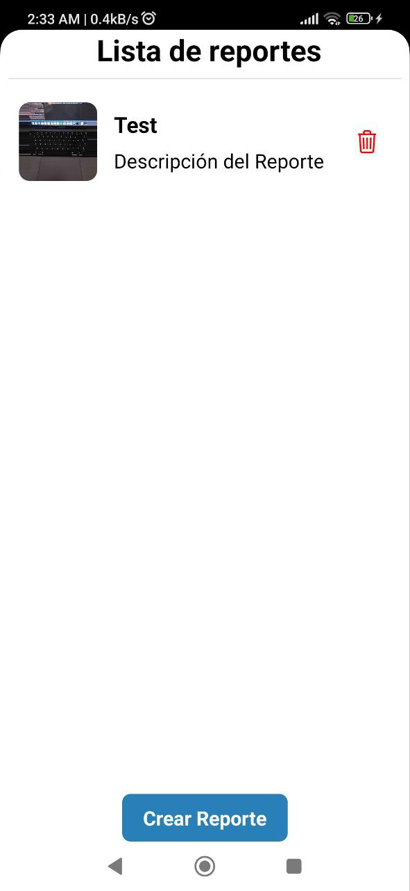
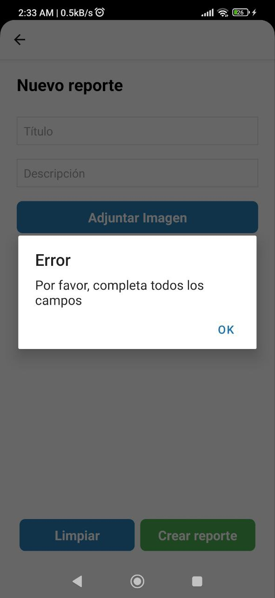
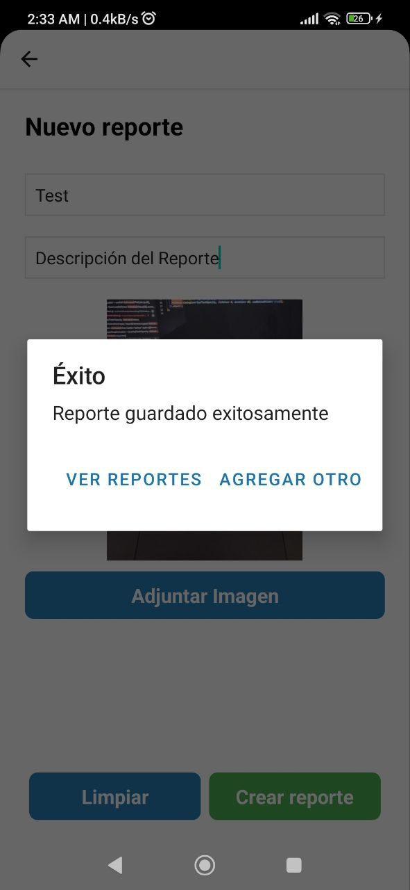

# REPORTAPP

### Technologies

  - [Yarn](https://yarnpkg.com/) (v1 or newer)
  - [Git](https://git-scm.com/)
  - [React Native](https://reactnative.dev)
  - [React Navigation](https://reactnavigation.org/)

## Screens Previews

<table style="border: 0">
  <tr>
    <td align="center"></td>
    <td align="center"></td>
    <td align="center"></td>
    <td align="center"></td>
    <td align="center"></td>
  </tr>
</table>

## Getting Started

To get a local copy of this project up and running, follow the steps below.

### Prerequisites

- Please follow the official doc to config your enviroment setup or update some dependencies if case the are deprecated
- You will need to have the following software installed on your machine:
  - [Node](https://nodejs.org/en/) (v14 or newer)
  - [Yarn](https://yarnpkg.com/) (v1 or newer)
  - [Git](https://git-scm.com/)
  - [React Native](https://reactnative.dev)
  - [React Navigation](https://reactnavigation.org/)

### Steps

- Clone the repository:
  git clone https://github.com/iJesusApm/reportapp
- Navigate into the project directory:
  cd reportapp
- Install the dependencies:
  `yarn install` or `npm install`
- if u dont haved, please install expo:
    `yarn add expo -g` or `npm install expo -g`
- Run the app on Android:
  `yarn android` or `npm run android`
- Run the app on iOS
  `yarn ios` or `npm run ios`

### Project Structure

From src:
- assets/: all the resources has been used in the app, like images, icon or fonts.
- components/: reusable components used across different screens.
- navigation/: the app's navigation components and configuration.
- screens/: screen components that render the UI and handle user interaction.
- App.tsx: the main entry point of the app.
